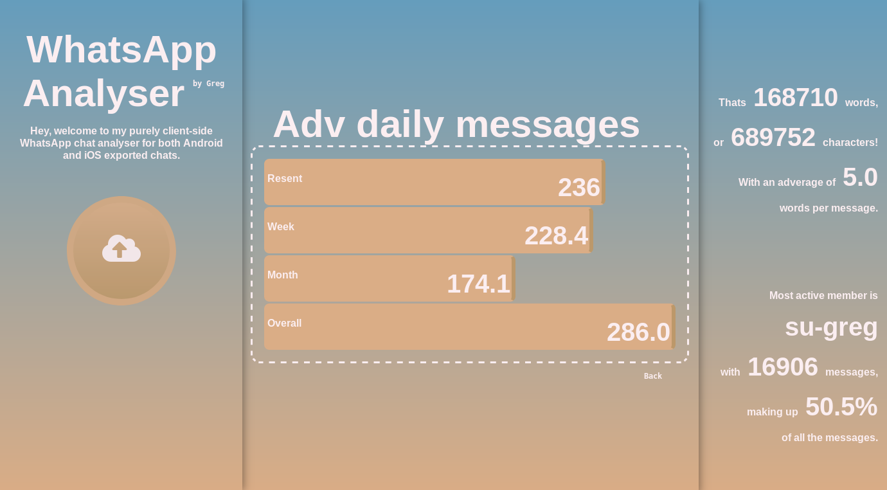

# WhatsApp-Analyser
This is my client-side WhatsApp chat analyser built with html and javascript using graphics generated by [canvasjs](https://canvasjs.com/) and in-house bar graphs.

You can also use this tool without having to download it via my github pages [Live version](https://su-greg.github.io/WhatsApp-Analyser/) which will always be online and up to date.

## Goal
My goal for this project was to create a good looking and very user friendly WhatsApp chat analyser for both Android and iOS exported chat files. It is completely client-sided, this is to prevent any sensitive data from leaving the client's device while also still remaining as quick as if it were running on the server-side. The page is scalable so that it can run on both a ultrawide monitor and a phone screen with equal grace, meaning that one version of the tool can suit all clients.

## Challenges
While developing this tool I realised that while it ran just fine on my desktop, my phone had a much harder time keeping up with all of the massive client-side processing. After some careful optimisation I was able to bring the performance to a similar level on pc as on mobile.

## TODO
* Add support for iOS exported chats.
* Drop canvasjs for graph.
* Optimise for mobile.
* CSS for mobile.
